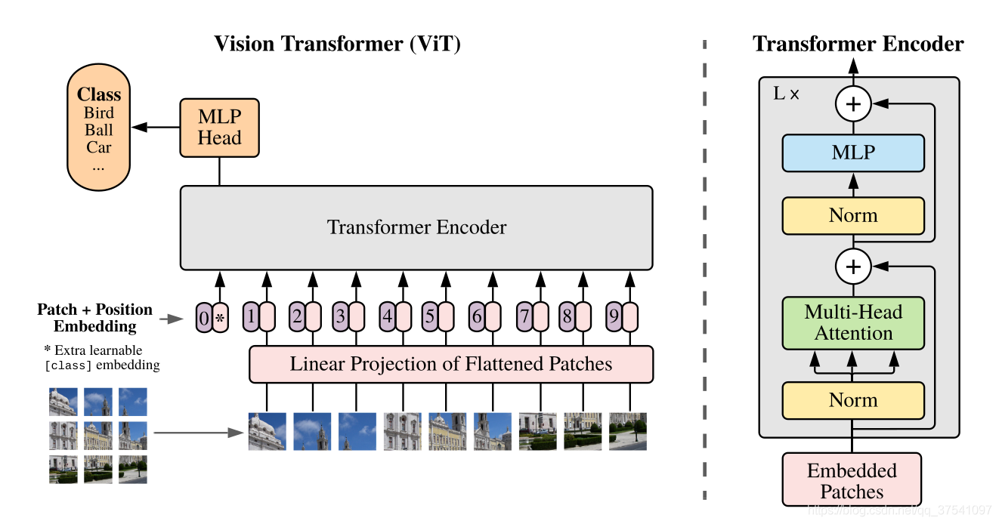
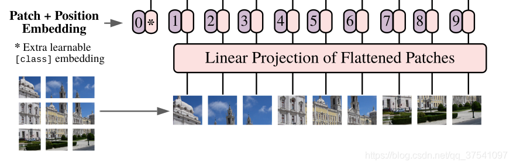
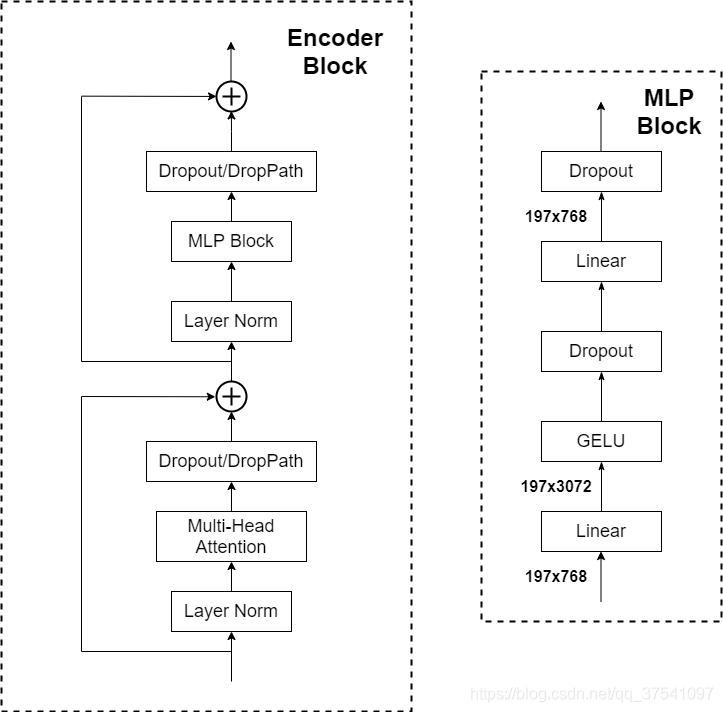
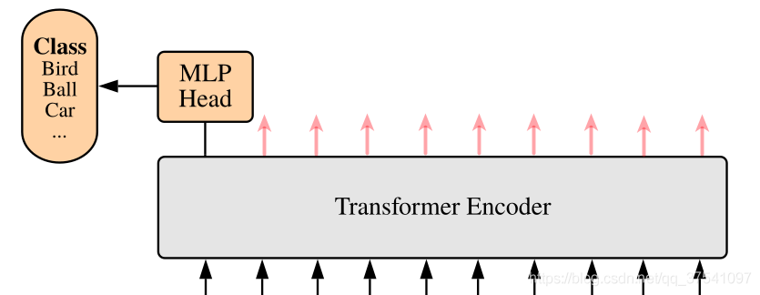
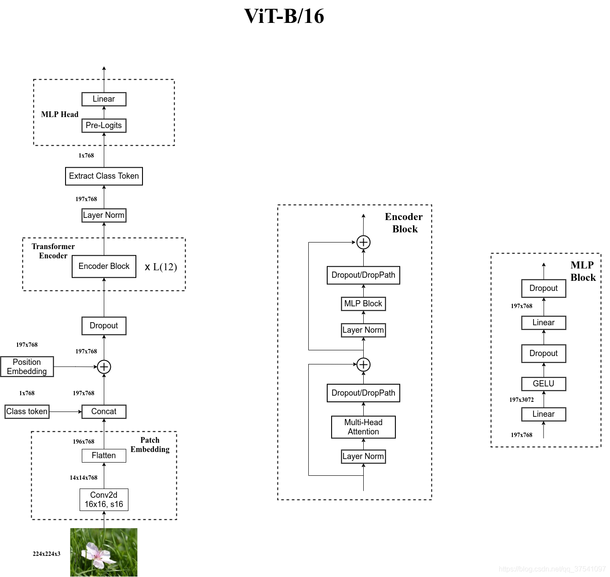

## Vision Transformer模型详解
下图是原论文中给出的关于Vision Transformer(ViT)的模型框架。简单而言，模型由三个模块组成：
- Linear Projection of Flattened Patches(Embedding层)
- Transformer Encoder(图右侧有给出更加详细的结构)
- MLP Head（最终用于分类的层结构）

### Embedding层

对于图像数据而言，其数据格式为[H, W, C]是三维矩阵明显不是Transformer想要的。所以需要先通过一个Embedding层来对数据做个变换。如下图所示，首先将一张图片按给定大小分成一堆Patches。以ViT-B/16为例，将输入图片(224x224)按照16x16大小的Patch进行划分，划分后会得到( 224 / 16 ) 2 = 196 (224/16)^2=196(224/16)
2
=196个Patches。接着通过线性映射将每个Patch映射到一维向量中，以ViT-B/16为例，每个Patche数据shape为[16, 16, 3]通过映射得到一个长度为768的向量（后面都直接称为token）。[16, 16, 3] -> [768]

在代码实现中，直接通过一个卷积层来实现。 以ViT-B/16为例，直接使用一个卷积核大小为16x16，步距为16，卷积核个数为768的卷积来实现。通过卷积[224, 224, 3] -> [14, 14, 768]，然后把H以及W两个维度展平即可[14, 14, 768] -> [196, 768]，此时正好变成了一个二维矩阵，正是Transformer想要的。

在输入Transformer Encoder之前注意需要加上[class]token以及Position Embedding。 在原论文中，作者说参考BERT，在刚刚得到的一堆tokens中插入一个专门用于分类的[class]token，这个[class]token是一个可训练的参数，数据格式和其他token一样都是一个向量，以ViT-B/16为例，就是一个长度为768的向量，与之前从图片中生成的tokens拼接在一起，Cat([1, 768], [196, 768]) -> [197, 768]。然后关于Position Embedding就是之前Transformer中讲到的Positional Encoding，这里的Position Embedding采用的是一个可训练的参数（1D Pos. Emb.），是直接叠加在tokens上的（add），所以shape要一样。以ViT-B/16为例，刚刚拼接[class]token后shape是[197, 768]，那么这里的Position Embedding的shape也是[197, 768]。

### Transformer Encoder层

Transformer Encoder其实就是重复堆叠Encoder Block L次，下图是我自己绘制的Encoder Block，主要由以下几部分组成：

- Layer Norm，这种Normalization方法主要是针对NLP领域提出的，这里是对每个token进行Norm处理，之前也有讲过Layer Norm不懂的可以参考链接
- Multi-Head Attention，这个结构之前在讲Transformer中很详细的讲过，不在赘述，不了解的可以参考链接
- Dropout/DropPath，在原论文的代码中是直接使用的Dropout层，在但rwightman实现的代码中使用的是DropPath（stochastic depth），可能后者会更好一点。
- MLP Block，如图右侧所示，就是全连接+GELU激活函数+Dropout组成也非常简单，需要注意的是第一个全连接层会把输入节点个数翻4倍[197, 768] -> [197, 3072]，第二个全连接层会还原回原节点个数[197, 3072] -> [197, 768]

### MLP Head层

上面通过Transformer Encoder后输出的shape和输入的shape是保持不变的，以ViT-B/16为例，输入的是[197, 768]输出的还是[197, 768]。注意，在Transformer Encoder后其实还有一个Layer Norm没有画出来，后面有我自己画的ViT的模型可以看到详细结构。这里我们只是需要分类的信息，所以我们只需要提取出[class]token生成的对应结果就行，即[197, 768]中抽取出[class]token对应的[1, 768]。接着我们通过MLP Head得到我们最终的分类结果。MLP Head原论文中说在训练ImageNet21K时是由Linear+tanh激活函数+Linear组成。但是迁移到ImageNet1K上或者你自己的数据上时，只用一个Linear即可。

### Vision Transformer网络结构 (以ViT-B/16为例)
